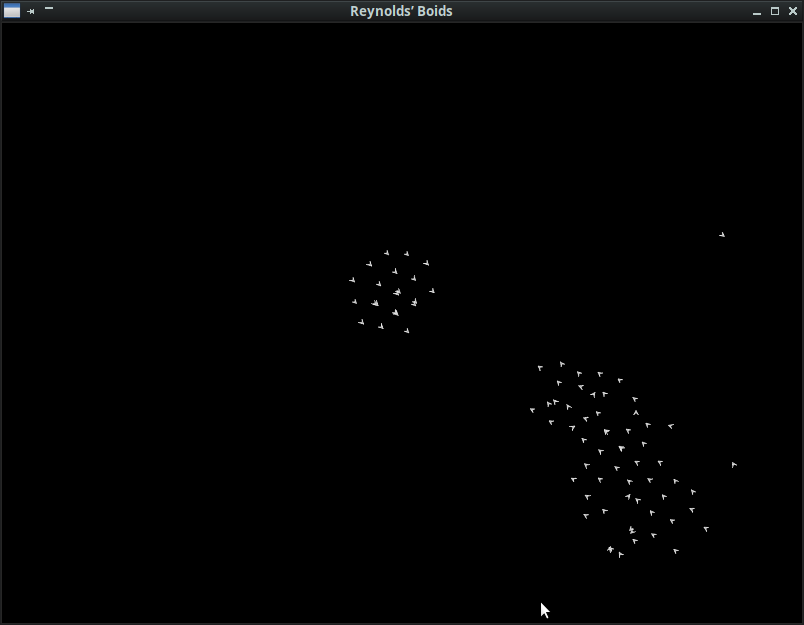

# love-boids
Demo of Reynolds' boids with the Lua framework LÖVE2D

You can run the [demo online](https://jehadel.github.io/love-boids/)

TO DO : 
- add interactivity (user could change boids parameters)
- add some explanations here
- could individualise parameters (boids characs values could have slight variations)
- boids could have dead angles (vision)